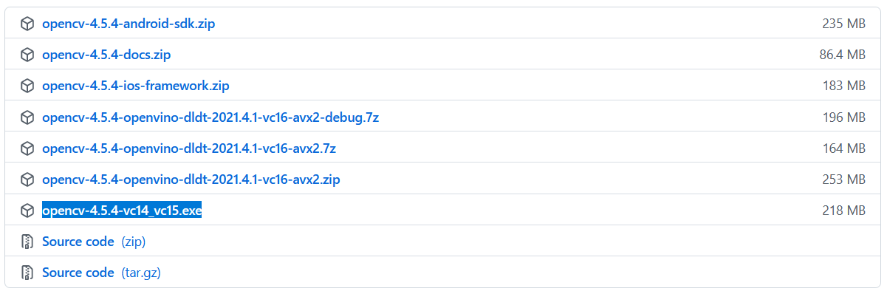
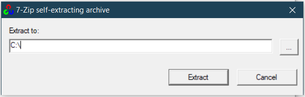
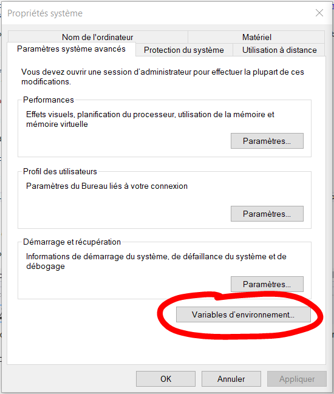
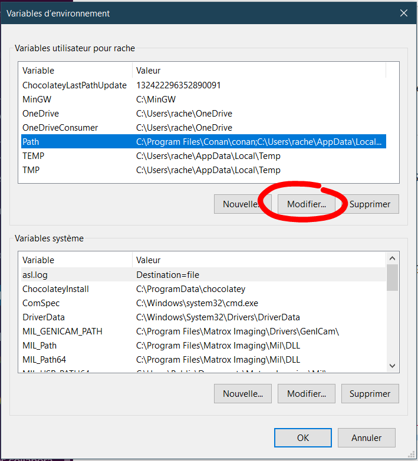
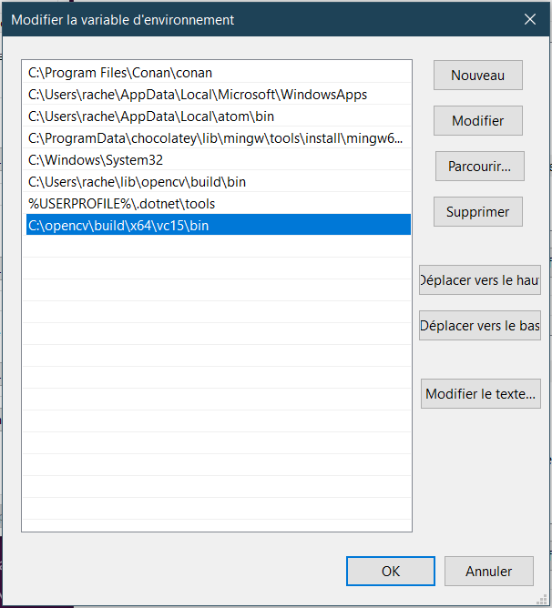

# TestAlgoApp

The TestAlgoApp solution is a console application which allows to run some C++ algorithms from UnitySC.AlgorithmLibrary. These algorithms use OpenCV librairy for image processing.


## Prerequisites

### Install OpenCV 4.5.4 pre-built library to Visual Studio 2019 on Windows 10 (64 bit)

The official documentation for OpenCV 4.5.4 (https://docs.opencv.org/4.x/d3/d52/tutorial_windows_install.html) still has vastly outdated contents on setting up OpenCV in Visual Studio (for C++). So, let’s take a quick dive into how to setup OpenCV 4.2.0 on Visual Studio 2019.

To use OpenCV with Visual Studio 2019 (using C++), be sure to select Desktop development with C++ during Visual Studio install !

* **Step 1: Download the pre-built library**

Download the "*opencv-4.4.5-vc14_vc15.exe*" binary from opencv’s Github repository.

Release files for 4.5.4 version are listed at https://github.com/opencv/opencv/releases/tag/4.5.4.



* **Step 2: Extract the pre-built library**

Run the downloaded .exe file to extract the archive to C:\



* **Step 3: Add opencv’s bin directory to path**

Edit environment variable to add opencv’s bin directory to PATH (the path to the bin directory should be "*c:\opencv\build\x64\vc15\bin*").








## PSI usage

This application executes a phase shift interferometry algorithm on a given directory containing interferometric images. It create a resulting interferometric file on subdirectory '*result*' added in the given directory.

Usage :

````console
./PSI.exe [STEP NUMBER] [WAVELENGHT] [DIRECTORY PATH] [OPTIONS]
````

OPTIONS :
````console
   -U, --unwrapping [Goldstein, HaiLei, Corr, Var, Grad] : use specific unwrapping algorithm

​                    [Goldstein]  use goldstein algorithm for unwrapping (used by default)
​                    [HaiLei]     use Hai Lei histogram reliability path algorithms for unwrapping
​                    [Corr]       use pseudo correlation quality algorithms for unwrapping
​                    [Var]        use variance quality algorithms for unwrapping
​                    [Grad]       use gradient quality algorithms for unwrapping
````


Example :

```console
./PSI.exe 7 618 ./testData -U Goldstein
```
